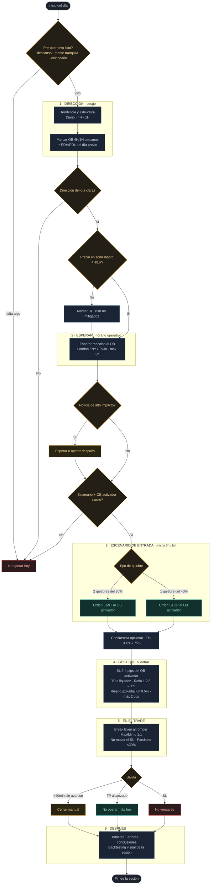

# MichaelFX — Diagrama de flujo

Secuencia operativa completa, del sesgo a la bitácora, con sus guardas (las salidas rojas =
**no operar**; la disciplina es parte de la estrategia). Horario UTC-5, máx. 3 h operativas.
Fuente: *Reglas de la Estrategia MichaelFX* (seminario). Ver [[MICHAELFX_STRATEGY.md]] para el detalle.

